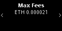

# app-plugin-kiln


This plug-in is compatible with Nano S / X devices, it enables to interact in a
secure with the Kiln deposit smart contract to stake Ethereum. It is based on
the [boilerplate example](https://github.com/LedgerHQ/app-plugin-boilerplate)
from Ledger.

Current implementation targets the Goërli network and is limited to the
`deposit` call.

## Unit Tests

The plug-in is currently unit tested using
[Speculos](https://github.com/LedgerHQ/speculos), to run tests:

```
cd tests
./build_local_test_elfs.sh
yarn test
```

## Existing Flows

### Nano S Deposit


### Nano X Deposit





