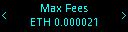

# app-plugin-kiln

This plug-in is compatible with Nano S / X devices, it enables to interact in a
secure wait with the Kiln deposit smart contract to stake Ethereum. It is based
on the [boilerplate example](https://github.com/LedgerHQ/app-plugin-boilerplate)
from Ledger.

## Existing Flows

### Nano S

#### Deposit

#### Withdraw Execution and Consensus Layer Fees

#### Withdraw Execution Layer Fees

#### Withdraw Consensus Layer Fees

### Nano X

#### Deposit

#### Withdraw Execution and Consensus Layer Fees

#### Withdraw Execution Layer Fees

#### Withdraw Consensus Layer Fees

